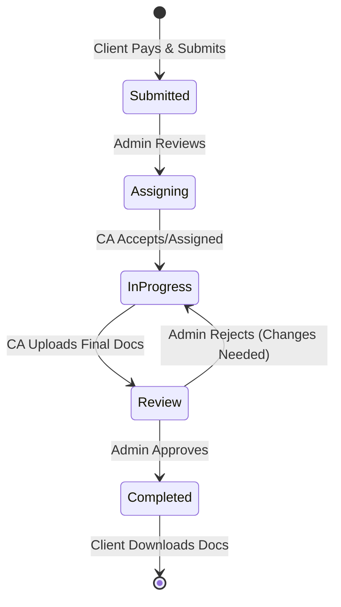

# ShineFiling Application Blueprint & Operational Workflow

This document outlines the end-to-end operational blueprint of the ShineFiling application, specifically tailored to the **User -> Admin -> CA (Binder) -> Client** workflow.

---

## 1. High-Level Flow Summary

The core workflow revolves around a "Bidding/Assignment" model where the Admin acts as the central hub connecting Clients with Chartered Accountants (CAs).

1.  **Client**: Submits Application & Payment.
2.  **Admin**: Receives Order -> Broadcasts/Shows to CAs (or specific CAs).
3.  **CA (Binder)**: Views available tasks -> Bids/Accepts Task -> Completes Work -> Uploads Final Docs.
4.  **Admin**: Verifies & Approves CA's work.
5.  **Client**: Automatically sees completed status & documents in their dashboard.

---

## 2. Detailed User Journey & System Workflow

### Phase 1: Client Submission (The "Order Source")
1.  **Service Selection**: User selects a service (e.g., *Private Limited Registration*) and a Plan (Startup/Standard/Elite).
2.  **Auth & Form**: User logs in, fills the detailed form, and uploads documents.
3.  **Payment**: User pays the total amount (Base + 15% Fees).
4.  **Order Creation**:
    *   System creates an **Order** with status `PENDING_ASSIGNMENT`.
    *   The "Payment Section" records the transaction details.
    *   **Notification**: Admin gets an alert: *"New Order Received: #ORD-123"*.

---

### Phase 2: Admin Dashboard (The "Control Tower")
*   **Incoming Orders View**: Admin sees all new orders.
*   **Financial Record**: Admin sees `Amount Collected` vs `CA Payout Pending`.
*   **Assignment Logic**:
    *   The order is made visible in a **"Task Marketplace"** or **"CA Pool"**.
    *   *Alternatively*, Admin can manually **Assign** the order to a specific CA based on expertise/load.

---

### Phase 3: CA Dashboard (The "Binder/Executor")
*   **Task Board**: CAs log in to their specialized dashboard.
*   **Available Tasks**: They see a list of orders (blinded or full details based on privacy) available for bidding/claiming.
*   **Bidding/Acceptance**:
    *   CA reviews the requirements.
    *   CA clicks **"Accept Task"** (or bids a price if that's the model).
*   **Execution**:
    *   Once assigned, CA gets full access to Client Data & Documents.
    *   CA performs the filing (DSC, Name Approval, Incorporation).
    *   *Communication*: CA can raise "Queries" back to Admin if client docs are missing.
*   **Completion**:
    *   CA uploads the final **Certificate of Incorporation (COI)**, **PAN**, **TAN**, etc.
    *   CA marks the task as `COMPLETED_PENDING_REVIEW`.

---

### Phase 4: Admin Review & Closure
1.  **Quality Check**: Admin receives the work submitted by the CA.
2.  **Verification**: Admin checks if the uploaded files are correct.
3.  **Approval**:
    *   Admin clicks **"Approve & Release"**.
    *   *Financial Trigger*: System records that the CA payout is now "Due/Cleared".
4.  **Status Update**: Steps the order status to `COMPLETED`.

---

### Phase 5: Client Dashboard (The "Result")
1.  **Auto-Update**: The moment Admin approves, the Client's dashboard updates.
2.  **Download Access**: Client sees "Registration Successful" and can download:
    *   Welcome Kit (Zip file).
    *   Invoice.
3.  **Notification**: Client gets an email/SMS: *"Your Company is Registered! Login to download docs."*

---

## 3. Technical State Transitions

## 4. Key Dashboard Features

### For Admin
*   **Master Grid**: Order ID | Client Name | Service | Assigned CA | Status | Date.
*   **CA Management**: List of registered CAs, their active tasks, and performance rating.
*   **Financials**: Net Revenue (Client Payment - CA Payout).

### For CA (Binder)
*   **My Tasks**: Active orders currently working on.
*   **New Opportunities**: Pool of unassigned orders.
*   **Earnings**: Wallet showing completed task payouts.

### For Client
*   **Timeline Tracker**: Visual progress bar (e.g., "Step 3 of 5: Filing in Progress").
*   **Document Vault**: Secure space to download uploaded docs and final certificates.

This blueprint ensures a seamless, professional flow where the Admin controls the quality while CAs execute the technical work.
